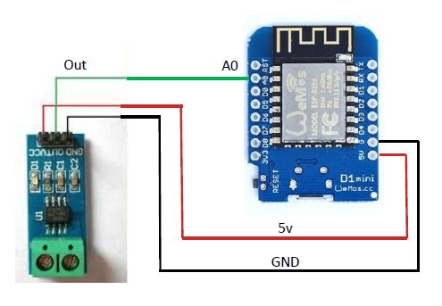
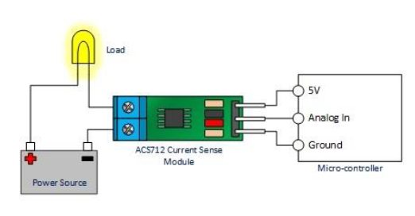

# Power Usage Monitor


In this project we built a current meter using the AC712 current sensor, instead of just displaying or reporting current measurements we made the project a little more interesting by calculating power consumption (which is just POWER = CURRENT x VOLTAGE), and reporting the power consumption via email. To make this project even more interesting we allow the user to set a daily power consumption limit, if the power consumption of the device you are monitoring reaches 25% of the set limit, you will receive a notification, you will receive another notification at 50% and when the device has reached the set power usage threshold. If all is well and no limits are exceeded, you will still receive an email notification at the end of each day with the daily usage for that day.

The AC712 sensors measures DC current, and comes in three models: 5A, 20A and 30A. We are using the 30A model [XC4610](https://jaycar.com.au/p/XC4610), which means you can use this model to measure most current sources in low voltage sources and appliances such as 12V/24V batteries, solar panels, portable fridges etc.

## Before you start:

There are plenty of example code for the AC712 on the Internet, we have chosen the AC712 library developed by Murat Demirtas, you can download this library at:

[https://github.com/muratdemirtas/ACS712-arduino-1](https://github.com/muratdemirtas/ACS712-arduino-1)

Because we are very lazy, we reused, verbatim, the Gmail email sender code published earlier in the Intruder Alert project. The set-up of the Gmail account is described in detail under that project, so we will not repeat it here.

## Components:


|Qty| Code | Description |
|---|---|---|
|1 | [XC3802](http://jaycar.com.au/p/XC3802) | ESP8266
|1 | [XC3850](http://jaycar.com.au/p/XC3850) | Prototype shield
|1 | [XC4610](http://jaycar.com.au/p/XC4610) | Current sensing module
|1 | [WH3025](http://jaycar.com.au/p/WH3025) | cable pack
|1 | [HM3230](http://jaycar.com.au/p/HM3230) | 40 pin female headers

## Circuit & Assembly

This project is very easy to build, only three wires from the AC712 to the ESP8266 D1 board, as shown in Figure 1 below. The Output pin from the AC712 is connected to the Analog In pin on the ESP8266 (A0).



Because the AC712 and ESP8266 D1 Mini are so small you can fit this project in almost any small enclosure. Only two wires from the AC712 to be connected in series with the load current you are measuring as depicted in Figure 2 below.



## Application Code

First unzip the code file, you see three files, these files are to be located under the same directory in order for the code to compile.

| File | Description |
|---|---
|Power_usage_Monitor.ino|This is the Arduino IDE source code file
|Gsender.h|This is the header file needed to run the code. You will only ever need to update this file once, with your Gmail details.
|Gsender.cpp|This is the library code file. You will not need to modify this file.

## Modifying the Gsender.h file:

From the Arduino IDE open the WiFi_Intruder_Alert.ino file. You will notice three tabs on the top of the main editor screen, click on the Gsender.h to view this file. There are only three lines which need to be updated in this file, to tell the application your email address, and login details, as shown below:

```c
const char* EMAILBASE64_LOGIN = "am9lbm91cjY1QGstYWlsLmNvbQ==";
const char* EMAILBASE64_PASSWORD = "RzBkMTVMJHZlNGV2ZXI=";
const char* FROM = "<your gmail address@gmail.com";
```

You will notice that the EMAILBASE64_LOGIN and EMAILBASE64_PASSWORD are encrypted, that is because you may not want to insert your private login details as plain text, so we use

[base64encode.org](https://www.base64encode.org/)

to generate the encrypt[ted version of our plain text email login credentials.

*Once you have done this insert the encrypted string into the above code.*

## Modifying the Power_Usage_Monitor.ino Source Code:

Open the main source code file Power_Usage_Monitor.ino, you will need to review and possibly edit the following parameters:

* Set the daily usage power limit, this is the threshold usage that will be used to send notification if exceeded. You can locate this parameter in the source code file line shown below;

```c
#define daily_usage_limit 1000 // This is the daily usage limit
```

* Now you need to specify the type of current measurement, whether you are measuring DC or AC current. Set the measurement_type variable to DC_current or AC_current, as illustrated below;

```c
int measurment_type = DC_current; // change this to the type of current - DC in this case
```

* Now you need to specify the voltage level, in order to correctly calculate the power consumption. Depending on the type of current you are measuring set the Vdc parameter to the voltage source you are measuring, as shown below;

```c
float Vdc = 12; // Edit this value to match the voltage level in your application.
```

## Tips & Tricks

When powering on the Power Usage Monitor make sure that no devices are attached upon start-up, because the unit calibrates itself on start-up. This is done in the setup routine by the following line of code:

```c
sensor.calibrate();
```
